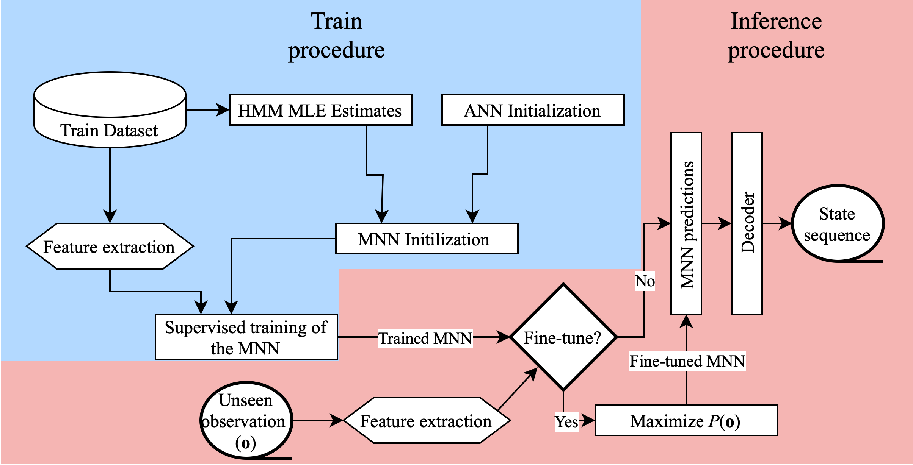
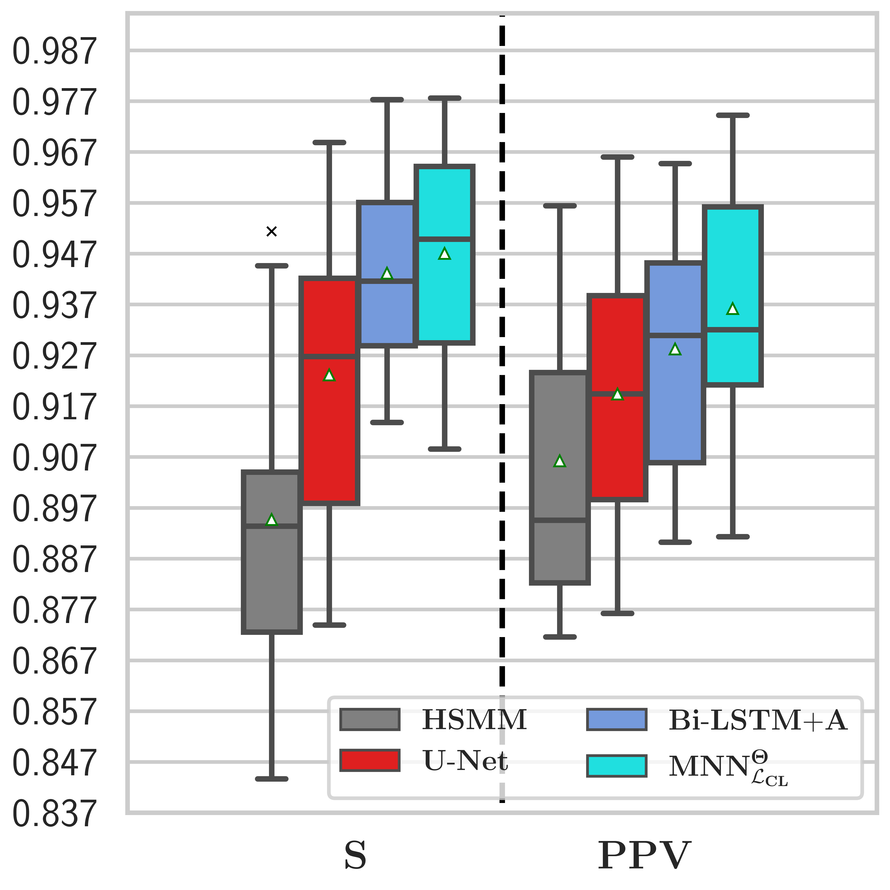
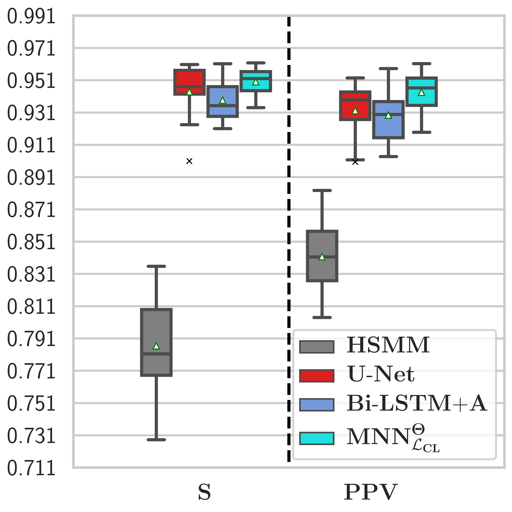
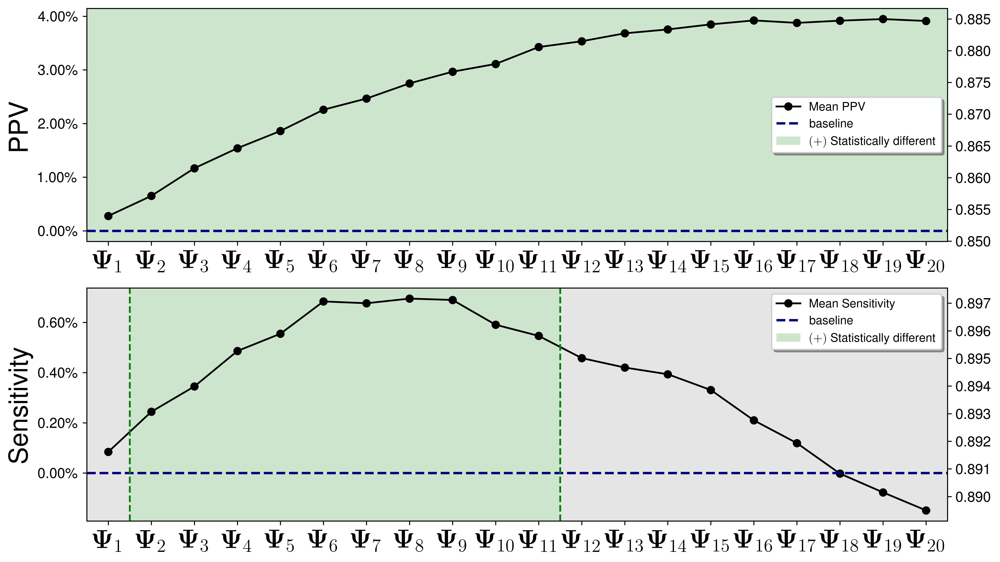

[](https://opensource.org/license/gpl-3-0/)
# Markov-based Neural Networks for Heart Sound Segmentation: Using Domain Knowledge in a principled way
*Markov-based Neural Network* (MNN) 
is a hybrid end-to-end framework that exploits Markov models as statistical inductive biases
for an Artificial Neural Network (ANN) discriminator. 
This repository provides the source code to replicate an
MNN leveraging a simple one-dimensional Convolutional ANN that significantly
outperforms two recent purely data-driven solutions for the task of fundamental 
heart sound segmentation in two publicly available datasets: 
[PhysioNet 2016 challenge dataset](https://archive.physionet.org/pn3/challenge/2016/) (Sensitivity: $0.947 \pm 0.02$; Positive Predictive Value: $0.937 \pm 0.025$)
and [CirCor DigiScope PhysioNet 2022 challenge dataset](https://moody-challenge.physionet.org/2022/) dataset (Sensitivity: $0.950 \pm 0.008$; Positive Predictive Value: $0.943 \pm 0.012$) datasets. 

We also introduce a gradient-based unsupervised fine-tuning algorithm that effectively makes the MNN adaptive to unseen datum sampled from unknown distributions. We show that a pre-trained MNN can learn to fit an entirely new dataset in an unsupervised fashion with remarkable gains in performance.


## Recommended requirements
1. Use anaconda/miniconda to create a __python 3.8.10__ virtual environment:
    ```zsh
    $ conda create --name env_name python=3.8.10
    ```
2. Activate environment and update pip:
    ```zsh
    $ (env_name) python3 -m pip install --upgrade pip
    ```
4. Use pip to install packages in `requirements.txt` file:
    ```zsh
    $ (env_name) pip install -r /path/to/project/requirements.txt
    ```
   
Note that this code was developed for tensorflow/tensorflow-gpu~=2.4.1. 

## Dataset files
We conduct our experiment using the [PhysioNet 2016 challenge dataset](https://archive.physionet.org/pn3/challenge/2016/)
and the [CirCor DigiScope PhysioNet 2022 challenge dataset](https://moody-challenge.physionet.org/2022/).

We provide files with the datasets processed as described in Section III-A of the IEEE JBHI publication. They can be located in this project's `datasets` subdirectory. 

Each observation is band-passed using [25, 400] Hz, downsampled to 1000 Hz, and its spikes are then procedurally removed. 

Finally, each signal is processed into 4 channels spanning i) the _homeomorphic_ envelogram, ii) the _Hilbert_ envelope, iii) the _Wavelet_ envelope, and iv) the _power spectral density_ envelope.

These features were extracted by adapting the approach previously published by [Springer _et al_](https://physionet.org/content/hss/1.0/). Dataset loading and processing utilies are available under the `data_processing` module.


## Running experiments 
### Supervised training in PhysioNet'16/CirCor DigiScope'22

The [PhysioNet'16](experiments/mnn_ph16_k_fold.py) and  [CirCor'22](experiments/mnn_circor22_k_fold.py) python scripts
use an argument parser so that the experiments can be configurable by the user. If no optional arguments are provided, the experiment will run exactly as reported in the IEEE JBHI publication. 

```console 
mnn_ph16_k_fold.py/mnn_circor22_k_fold.py [-h] [-k NUMBER_FOLDERS] [-e NUMBER_EPOCHS]
                          [-lr LEARNING_RATE] [--hybrid] [--no-hybrid]

optional arguments:
  -h, --help            show this help message and exit
  -k NUMBER_FOLDERS, --number_folders NUMBER_FOLDERS
                        The number k of folds for cross-validation. Defaults
                        to 10.
  -e NUMBER_EPOCHS, --number-epochs NUMBER_EPOCHS
                        The number of train epochs per fold. Defaults to 50.
  -lr LEARNING_RATE, --learning_rate LEARNING_RATE
                        The learning rate for the Adam gradient descent
                        optimizer. Defaults to 1e-3.
  --hybrid              Use hybrid training. Script defaults to this mode.
  --no-hybrid           Use static training. Overrides default hybrid
                        training.
```

The experiment's predictions are logged under `/path/to/project/name_of_script/yyyy-mm-dd_hh:mm:ss`.
`name_of_script` is automatically set as a function of the parameters of the experiment script.

The experimental logs will contain, for each fold:
* The indices used to partition the fold into __train/val/test__.
* The MNN's weights (HMM + ANN weights)
* The ANN's posterior estimates (`output_seqs`)
* The MNN's segmentation proposals (`predictions`)
* The ground truth state labels (`ground_truth`)


## Cross-dataset unsupervised fine-tuning 
The [cross-dataset fine-tuning python script](experiments/mnn_fine_tune.py) allows
to load a pre-trained MNN and fine-tuned it to PhysioNet'16/CirCor'22 dataset. 
se an argument parser so that the experiments can be configurable by the user:

```console
usage: mnn_fine_tune.py [-h] [-k NUMBER_FOLDERS] [-e NUMBER_EPOCHS]
                        [-lr LEARNING_RATE] [-d MODEL_DIRECTORY] [--ph16]
                        [--circor22] [--hybrid] [--no-hybrid]

optional arguments:
  -h, --help            show this help message and exit
  -k NUMBER_FOLDERS, --number_folders NUMBER_FOLDERS
                        The number k of folds for cross-validation. Defaults
                        to 10.
  -e NUMBER_EPOCHS, --number-epochs NUMBER_EPOCHS
                        The number of train epochs per fold. Defaults to 50.
  -lr LEARNING_RATE, --learning_rate LEARNING_RATE
                        The learning rate for the Adam gradient descent
                        optimizer. Defaults to 1e-3.
  -d MODEL_DIRECTORY, --model_directory MODEL_DIRECTORY
                        The relative path where the MNN's pre-trained weights
                        are stored. Defaults to a MNN pre-trained in the CirCor'22 dataset.
  --ph16                Fine-tune to PhysioNet'16. Default option.
  --circor22            Fine-tune to CirCor'22.
  --hybrid              Use hybrid training. Script defaults to this mode.
  --no-hybrid           Use static training. Overrides default hybrid
                        training.
```

If no optional arguments are provided, 
the experiment will load a pretrained model in CirCor'22 and fine-tune to the PhysioNet'16 dataset as described in Section IV-C.3 of the IEEE JBHI publication.

We provide two pre-trained model weights for the MNN baseline initialization under `pretrained_models/circor_pretrain` and `pretrained_models/ph16_pretrain.`

The experiments will be logged in a `.hdf5` file that will contain, for each fold, for each fine-tuning round:
* The indices used to partition the fold into __train/val/test__.
* The MNN's segmentation proposals (`predictions`)
* The ground truth state labels (`ground_truth`)

## Measured Results
### Supervised
Comparison of static MNN optimized for the complete likelihood with the HSMM by Springer _et al._, the U-Net by Renna _et al., and the Bi-LSTM+A by Fernando _et al._.
#### 10-fold cross-validation PhysioNet'16



#### 10-fold cross-validation CirCor'22


### Unsupervised
### Fine-tuning from CirCor'22 to PhysioNet'16
Initialization using the parameters $\Psi_0$ attained after training in the PhysioNet'16. 
Relative improvement of parametrization $\Psi_i$, attained after $0 \leq i \leq 20$ rounds of fine-tuning to the CirCor'22 dataset.
